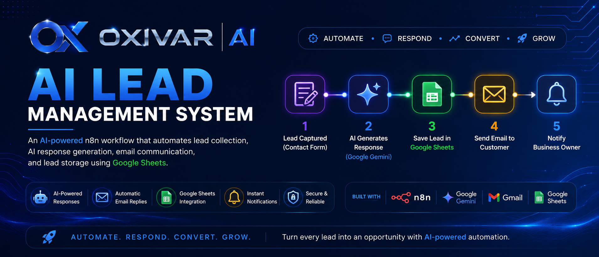
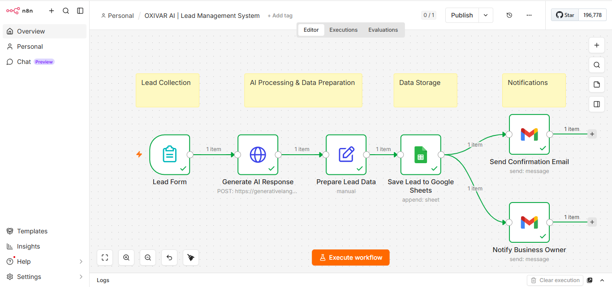
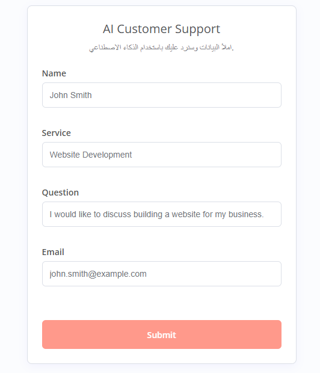
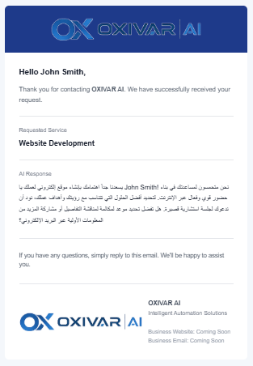
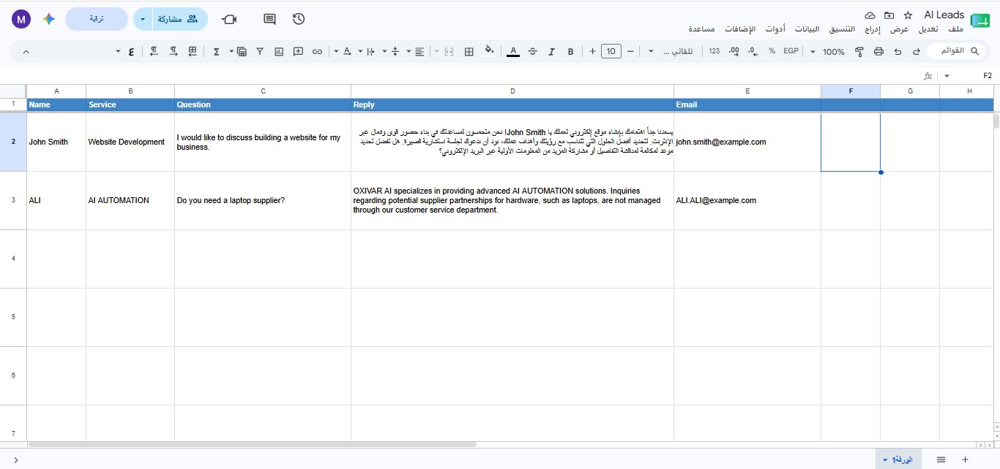

<p align="center">
  
</p>

<p align="center">
  
</p>

<h1 align="center">AI Lead Management System</h1>

<p align="center">
An AI-powered workflow that automates lead collection, AI response generation, email communication, and lead management using n8n, Google Gemini, Gmail, and Google Sheets.
</p>

<p align="center">


</p>

<p align="center">
<b>Automate your lead management from submission to follow-up with AI-powered workflows.</b>
</p>

---

# 📌 Overview

The **AI Lead Management System** is an intelligent workflow that automates the complete lead management process.

Once a customer submits the contact form, the system automatically:

- 📥 Collects lead information
- 🤖 Generates an AI-powered response using Google Gemini
- 📊 Stores the lead in Google Sheets
- 📧 Sends a professional HTML confirmation email
- 🔔 Notifies the business owner instantly

The entire workflow is built with **n8n**, reducing manual work while improving customer response time and consistency.

---

## 📚 Table of Contents

- [Overview](#-overview)
- [Features](#-features)
- [Tech Stack](#-tech-stack)
- [Workflow Overview](#-workflow-overview)
- [Demo](#-demo)
- [Screenshots](#-screenshots)
- [Project Structure](#-project-structure)
- [Installation](#-installation)
- [Business Benefits](#-business-benefits)
- [Future Roadmap](#-future-roadmap)
- [About OXIVAR AI](#-about-oxivar-ai)

---

# ✨ Features

- 🤖 AI-generated customer replies
- 📋 Automatic lead collection
- 📧 Professional HTML confirmation emails
- 📊 Google Sheets lead database
- 🔔 Instant business owner notifications
- ⚡ Fully automated workflow powered by n8n
- 🔒 Secure credential management
- 🧩 Easy to customize for different businesses

---

# 🛠 Tech Stack

| Technology | Purpose |
|------------|---------|
| n8n | Workflow Automation |
| Google Gemini | AI Response Generation |
| Gmail API | Email Automation |
| Google Sheets API | Lead Storage |

---

# 🔄 Workflow Overview

```text
Customer Contact Form
          │
          ▼
Receive Lead
          │
          ▼
Generate AI Response
          │
          ▼
Prepare Lead Data
          │
          ▼
Save Lead to Google Sheets
          ├────────► Send HTML Confirmation Email
          └────────► Notify Business Owner
```

---

# 🎬 Demo

*A short demo GIF showcasing the workflow will be added in a future update.*

---

# 📸 Screenshots

## Workflow

<p align="center">

</p>

---

## Contact Form

<p align="center">

</p>

---

## Customer Confirmation Email

<p align="center">

</p>

---

## Google Sheets Lead Database

<p align="center">

</p>

---

# 📂 Project Structure

```text
ai-lead-management-system/
│
├── assets/
│   └── logo-horizontal.png
│
├── screenshots/
│   ├── workflow.png
│   ├── form.png
│   ├── email.png
│   └── google-sheet.png
│
├── workflows/
│   └── ai-lead-management-system.json
│
├── LICENSE
├── README.md
└── .gitignore
```

---

# 🚀 Installation

1. Import the workflow into **n8n**.
2. Configure **your own** credentials:
   - Google Gemini API
   - Gmail
   - Google Sheets
3. Select your Google Sheets document.
4. Activate the workflow.
5. Start receiving AI-powered leads automatically.

---

# 💼 Business Benefits

- Save hours of manual work
- Respond to customers instantly
- Deliver consistent AI-powered communication
- Centralize lead management
- Improve customer experience
- Scale your workflow with minimal effort

---

# 🔮 Future Roadmap

- CRM Integration
- Analytics Dashboard
- Lead Status Tracking
- Multi-language Support
- PDF Proposal Generator
- Calendar Booking Integration
- Slack & Discord Notifications

---

# 👨‍💻 About OXIVAR AI

**OXIVAR AI** develops intelligent automation solutions that help businesses streamline operations, improve customer communication, and eliminate repetitive work using modern AI-powered workflows.

This repository is part of the official **OXIVAR AI Automation Portfolio**, showcasing real-world automation systems built with AI and no-code technologies.

---

## ⭐ Support

If you found this project useful, consider giving it a ⭐ on GitHub.

## 📄 License

This project is licensed under the MIT License. See the [LICENSE](LICENSE) file for more information.
---

<p align="center">
<b>Built with ❤️ using n8n & Google Gemini</b>

<br><br>

© 2026 <b>OXIVAR AI</b>

</p>
